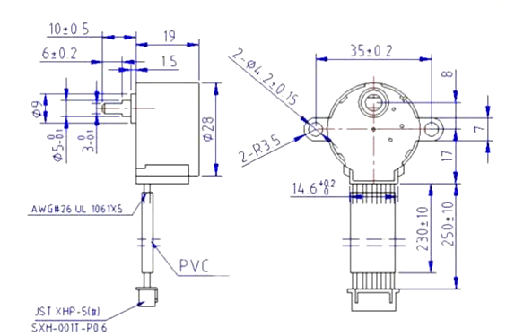
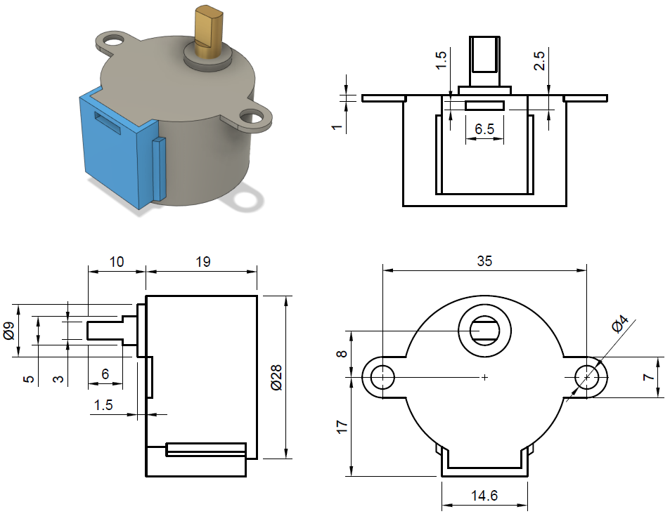
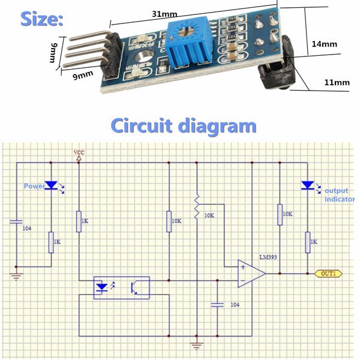
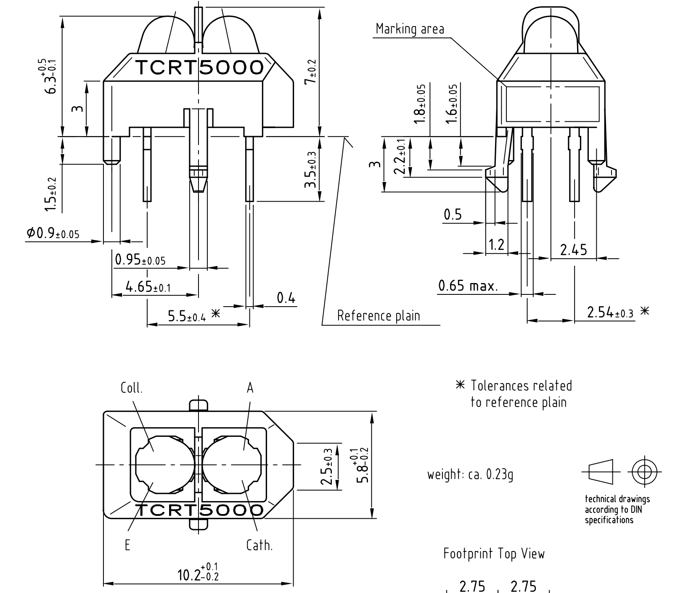

# Sezon 01 - Fusion 360 projektowanie pod laser i druk 3D

## Co robiliśmy

Na przykładzie modelowania uchwytu do steppera i czujnika.

Pełne wymiary steppera typu `28BYJ-48`

 

Uproszczone wymiary steppera typu `28BYJ-48`

Wymiary modułu z czujnikiem TCRT5000

Wymiary czujnika TCRT5000

### Wprowadzenie do obsługi Fusion 360
- Koncepcja interfejsu
- Gdzie są pliki
- Jak dzielić pliki
- Historia zmian i praca na historii

### Tworzenie szkicu 
- Linia, prostokąt,
- Wymiarowanie, parametryzacja wymiarów
- Ograniczenia: line konstrukcyjne, środkowanie, prostopadłość ...  
- Walidacja szkicu
- Eksport do cięcia plik `DXF`
- Typ pliku obsługiwany przez nasz soft do lasera `DXF wersja R14`
- LibreCAD konwersja do `R14`

## Tworzenie brył
- Wyciąganie `Exdrude`
- Export do druku 3D

## Przygotowanie do druku
- Podstawy Z-Siute
- Podpory
- Typowe problemy jak np. grubość ściany, kurczenie 

## Materiały
- [Fusion 360 Product Documentation](https://help.autodesk.com/view/fusion360/ENU)
- [LibreCAD - Open Source 2D-CAD](https://librecad.org)
- [Z-SUITE BETA - converting 3D files into models](https://support.zortrax.com/downloads/)

