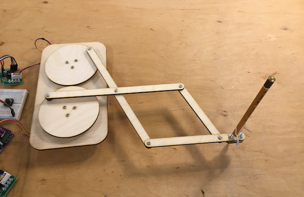
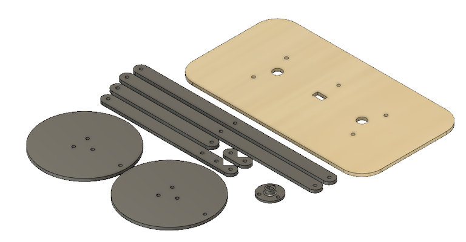

# Sezon 03 - budowanie maszyny rysującej  

## Co robiliśmy

- Omówienie projektu w Fusion 360
- Obsługa drukarki 3D i zdejmowanie wydruku
- Montaż wyciętych i wydrukowanych elementów maszyny
- Kod testowy i sprawdzenie działania

Maszyna po złożeniu

## Kod

- Obroty ze stałą prędkością kod `ConstantSpeed`.
- Instrukcja `setSpeed();` ustala prędkość, a w `loop(){…}` instrukcja `runSpeed();` wykonuje ruch z zadaną prędkością.

## Projekt

Link do projektu maszyny w Fusion 360
https://a360.co/3bFAhYG

Widok z Fusion 360

## Materiały

- Symulator online maszyny rysującej
http://dwarrenku.github.io/DrawingMachine/ 

- Obsługa drukarki
** https://support.zortrax.com/m200-components/
** https://support.zortrax.com/printing-materials-overview/
** https://support.zortrax.com/m-series-printers-modes/
** https://support.zortrax.com/m-series-removing-the-print/
