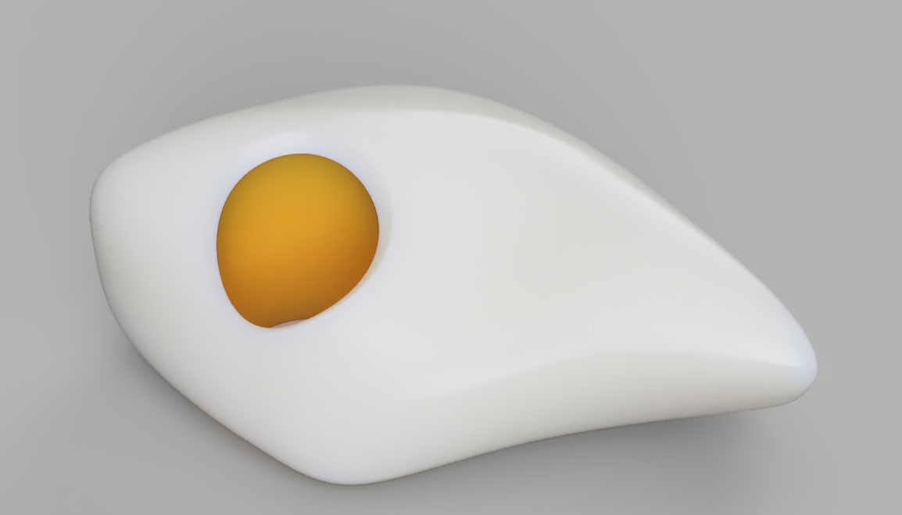
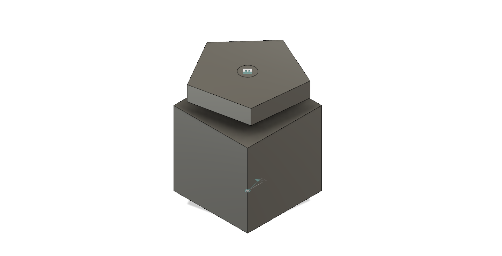
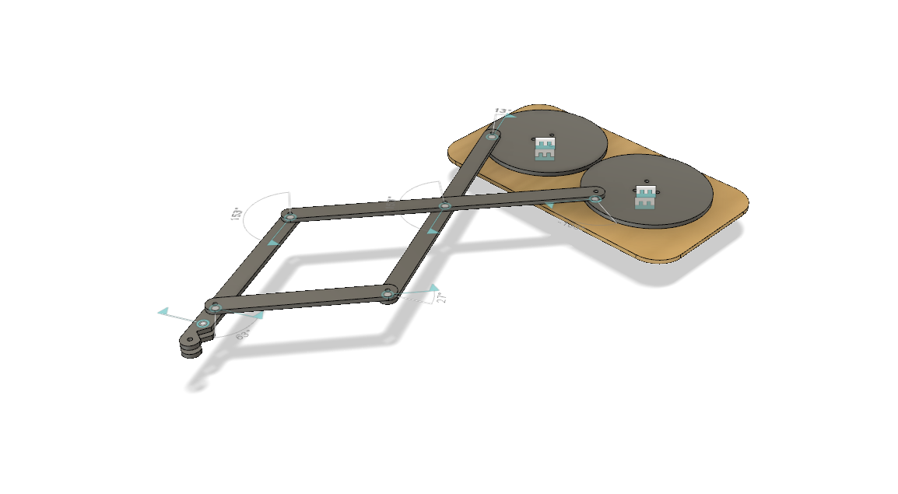
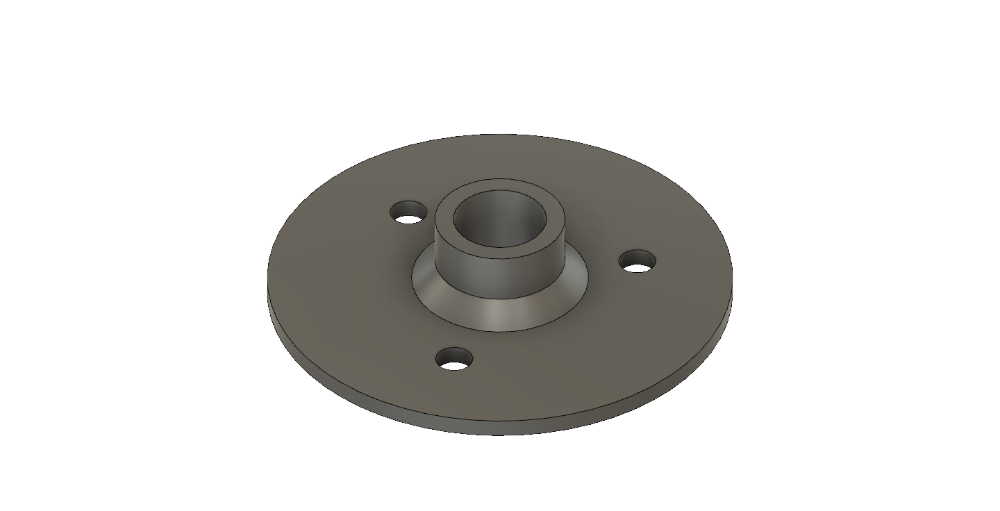
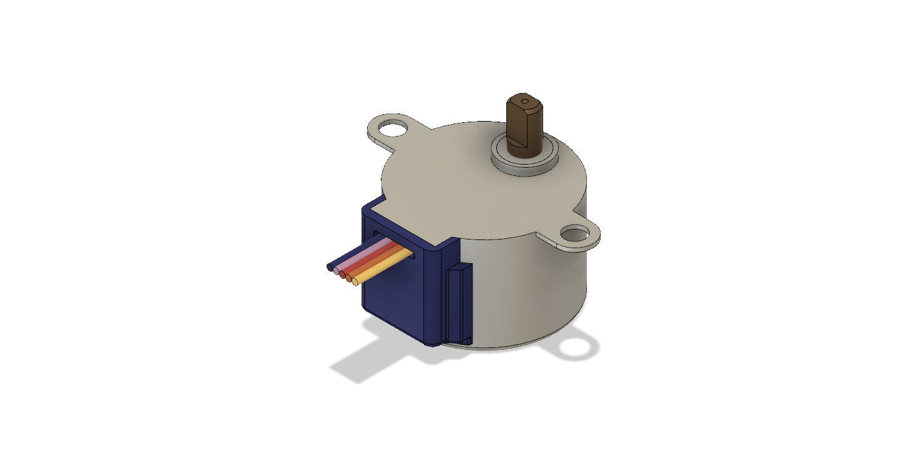

# Sezon 04 - Montaż i testowanie ruch. Dodatkowo free form i projektowanie dla druku 3D  

## Co robiliśmy

- Modelowanie organicznych kształtów za pomocą Free Form. 
- Montaż i testowanie ruchu: Join (J), Ground
- Od rysunku do modelu dla druku 3D
- Pomocnicze polecenia: Capture Image, Apperance

## Projekty

Modelowanie Free Form + dodanie wizualizacji

https://a360.co/391zEIh

Wprawka w tworzeniu ruchomych obiektów

https://a360.co/3s5jKUB

Maszyna rysująca po złożeniu:

https://a360.co/3tDU5Tt

Od rysunku do modelu dla druku 3D

https://a360.co/3tBTr96

Do pobrania model stepper motor

https://gallery.autodesk.com/fusion360/projects/86268/stepper-motor-28byj-48?searched

## Materiały

- Fusion 360: Creating Assemblies

https://academy.autodesk.com/curriculum/fusion-360-creating-assemblies